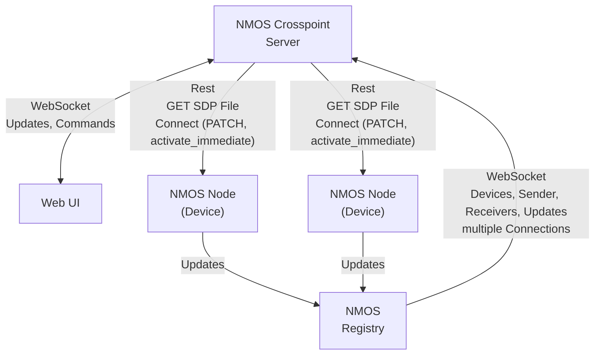

# NMOS Crosspoint

This tool is intended as a simple Orchestration layer for NMOS and ST2110 based Media Networks. 


This tool is tested against a lot of devices and now stable and performant with more than 2000 Flows.

## Features

### Core NMOS Functionality
- **Complete NMOS Device Discovery**: Automatic discovery and real-time monitoring of all NMOS devices, senders, receivers, and flows
- **Crosspoint Switching**: Intuitive crosspoint-style interface for connecting flows to receivers
- **Multi-Registry Support**: Connect to multiple NMOS registries across different network segments
- **Real-time Updates**: WebSocket-based live updates for device status and connection changes
- **Flow Management**: Enable/disable flows, manage multicast addresses, and handle connection states
- **Automatic Reconnection**: Smart reconnection logic on flow changes and network disruptions

### Device Integration & Control
- **Matrox Convert IP Integration**: 
  - Per-device multiviewer mode control
  - PTP (Precision Time Protocol) enable/disable functionality
  - Flexible device identification (serial numbers, names, aliases)
  - Device grouping to consolidate all video/audio channels per physical device
- **Device Deduplication**: Intelligent merging of devices with different identifier formats
- **Proprietary Device Abstractions**: Extensible framework for device-specific control and monitoring

### External System Integration
- **Q-SYS Integration**: Comprehensive Lua script for Q-SYS control systems with WebSocket API
- **Companion Integration**: Connection to Bitfocus Companion for advanced control workflows
- **WebSocket API**: Full-featured API for third-party integrations and custom applications

### Network & Performance
- **High Performance**: Tested stable with 2000+ flows in production environments
- **Multi-Network Support**: Operates across multiple network segments (OOB, production, backup)
- **Advanced Routing**: Intelligent path selection and failover capabilities
- **Network Topology Awareness**: Understanding of network structure for optimal routing decisions

## Planned Features

- **Virtual Senders and Receivers**: Software-based endpoints for flexible routing
- **Network Topology Visualization**: Interactive network mapping and visualization
- **SDN-style Intelligent Routing**: Network-aware, active routing with path optimization
- **NMOS IS-07 Events**: Enhanced event and tally integration (WebSocket streams already supported)
- **NMOS IS-08 Channel Mapping**: Advanced audio channel mapping and control
- **Enhanced Device Abstractions**: Support for additional manufacturer-specific device types
- **Advanced Analytics**: Connection statistics, network performance monitoring, and usage analytics

## Recent Enhancements

- ✅ **Matrox Convert IP Integration**: Complete multiviewer and device control functionality
- ✅ **Device Grouping**: All video/audio channels consolidated per physical device
- ✅ **Q-SYS Integration**: Comprehensive Lua script with WebSocket API control
- ✅ **Enhanced Documentation**: Complete API documentation and usage guides
- ✅ **Device Deduplication**: Intelligent handling of multiple device identifier formats
- ✅ **WebSocket API**: Full-featured API for external integrations

## Changes from Version 1.0

- Complete redesign of the server core for supporting more features
- Multithreaded Server
- Complete redesign of the UI. (Switched from Angular to Svelte due to performance)
- Added basics for implementation of device abstractions
- Lot of Bug fixing

## System Integrations

### Q-SYS Control Systems
Comprehensive integration with QSC Q-SYS platforms via Lua scripting:
- **Real-time WebSocket Communication**: Direct connection to NMOS Crosspoint Router
- **Crosspoint Control**: Make/break connections between encoders and decoders
- **Matrox Multiviewer Control**: Per-decoder multiviewer toggles with automatic master mode
- **Device Discovery**: Automatic discovery and control of NMOS devices
- **JSON Preset Support**: Load and save connection configurations
- **Debug Logging**: Comprehensive troubleshooting capabilities

**Files**: `scripts/q-sys-crosspoint-control.lua`, `scripts/README.md`

### Matrox Convert IP Devices
Native integration for Matrox Convert IP encoder/decoder control:
- **Multiviewer Mode**: Enable/disable multiviewer with automatic master mode activation
- **PTP Control**: Precision Time Protocol enable/disable functionality
- **Device Management**: Flexible device identification and status monitoring
- **Device Grouping**: Consolidate all video/audio channels per physical device
- **REST API Integration**: Direct integration with Matrox device APIs

**Backend Module**: `server/src/mediaDevices/matroxConvertIp.ts`

### WebSocket API
Full-featured API for custom integrations and third-party applications:
- **Real-time Synchronized Objects**: Live device and flow state updates
- **Device Control Routes**: Connection management, flow control, device-specific commands
- **Matrox-specific Routes**: `matroxcip_togglemultiviewer`, `matroxcip_toggleptp`
- **Authentication Support**: Secure access with user management

**Documentation**: `docs/WEBSOCKET_API.md`

### Bitfocus Companion
Integration with Companion for advanced control workflows and panel interfaces.

## Dependencies

### NMOS Registry
This tool requires a working NMOS Registry running in the network. We test against [nmos-cpp](https://github.com/sony/nmos-cpp) in a docker container.

To get one up and running, you can use the one provided by rhastie: [https://github.com/rhastie/build-nmos-cpp](https://github.com/rhastie/build-nmos-cpp)

### Runtime Requirements
- **Node.js**: Version 20 or higher
- **Network Access**: Connectivity to NMOS registries and target devices
- **WebSocket Support**: For real-time communication and external integrations

## Configuration

You can simply rename the `server/config_example` folder to `server/config` please see the config files for possible Settings, documentation has to be done.

At startup on some installations there are some warnings about missing files, the System will create these files as soon as there is something to store.
As there is no `state` folder on some installations these fiels are not created. Just create a state folder and the subfolders named in the warnings and you are fine. You do not need to create the files.

There is a Bug with Authentification which does not allow unauthentificated access. Will be fixed soon, but for now you have to crete a password (SHA256 in the `users.json` file)

## Installation

The simplest way to get NMOS Crosspoint up and running is to use Docker Compose.

Make sure to change `docker-compose.yml` for your environment.
```shell
docker-compose up
```
This will create and start one Docker Container with a node express server.
Just point your Browser to the IP of the created Docker Container at port 80

## Just run it !

If you have a NMOS Registry in the network (Easy-NMOS for example) you can just start this tool on any computer.
You will need an Installation of Node.js Version 20, change to the `server`folder and just run: `node ./dist/server.js`.

## Network

NMOS Crosspoint can find and use multiple Registries, over all attached networks. Usually I test in an environment with the following networks:
- OOB (Out of Band Management network)
- Amber (Main Media network)
- Blue (Backup Media network)

NMOS Crosspoint can be connected to even more networks and will try to reach devices over multiple interfaces if they provide multiple endpoints to the registry.
In theory, one should be able to get a complete failover. 

At this time, NMOS Crosspoint does not handle the multiple "Legs" (network interfaces) presented by NMOS in a inteligent way. So there is no mapping for subnets or any desicion which Legs can connect.
Leg 1 of a sender is always connected to Leg 1 of a receiver, the SDP Manifest files are not modified in any way. 
There are plans to see the whole network topology and handle lots of these things.

Unfortunately, some devices do not present their NMOS API on all interfaces. So for best compatibility, NMOS Crosspoint and the API should be present in all networks. If the NMOS Registry is configured manually in the devices, one can also use routing.

## How it works




## Development

```
docker-compose up nmos-crosspoint-dev
```
Will start one Docker Container with a live updating Node Server.
For both folders, `/ui` and `/server` you could also run `npm install` and `npm run dev` for a local development session. 

In development mode it is extremely usefull for debugging as you can nearly live modify patch commands and the interpretation of NMOS data. under `http://<ip:port>/debug` you can see the full live updating crosspoint and NMOS data. Under `http://<ip:port>/log` there is lots of usefull data while making connections.

## Standalone

It is possible to run this tool without docker. Still there is need for a NMOS Registry, nmos-cpp can be built and operated without Docker.

```shell
# build the angular app
cd ./ui
npm install --force         # force is required for ace (json rendering, to be fixed or replaced)
npm run build                
cd ..

# build the server (typescript has to be globally available)

cd ./server
npm install
# optional:    npm install -g typescript@latest
tsc
node ./dist/server.js
```

Check the `Dockerfile.dev` for information on how to start live development servers.


